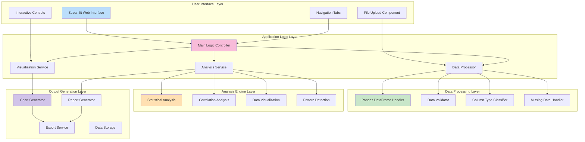

# 🏗️ **System Block Diagram**

## EDA Application Architecture

This document provides a detailed view of the system architecture and component relationships for the EDA application.

## 🔧 **5-Layer System Architecture**

## 🏛️ **Layer Descriptions**

### **1. User Interface Layer**
- **Streamlit Web Interface**: Main application container
- **File Upload Component**: Handles CSV file uploads
- **Navigation Tabs**: Provides organized access to different features
- **Interactive Controls**: Dropdowns, sliders, and user inputs

### **2. Application Logic Layer**
- **Main Logic Controller**: Orchestrates overall application flow
- **Data Processor**: Manages data transformation and preparation
- **Visualization Service**: Handles chart creation and management
- **Analysis Service**: Coordinates statistical analysis operations

### **3. Data Processing Layer**
- **Pandas DataFrame Handler**: Core data structure management
- **Data Validator**: Ensures data quality and format
- **Column Type Classifier**: Automatically identifies data types
- **Missing Data Handler**: Manages incomplete data scenarios

### **4. Analysis Engine Layer**
- **Statistical Analysis**: Calculates descriptive statistics
- **Correlation Analysis**: Identifies relationships between variables
- **Data Visualization**: Creates various chart types
- **Pattern Detection**: Finds trends and anomalies in data

### **5. Output Generation Layer**
- **Chart Generator**: Produces interactive visualizations
- **Report Generator**: Compiles analysis results
- **Export Service**: Handles file downloads
- **Data Storage**: Manages session data and caching

## 🔄 **Data Flow Patterns**

### **Primary Flow**
1. **Input**: User uploads CSV → File Upload Component
2. **Processing**: Data flows through Data Processor → Pandas Handler
3. **Analysis**: Analysis Service coordinates with Analysis Engine
4. **Output**: Visualization Service generates charts via Chart Generator
5. **Delivery**: Results displayed in User Interface

### **Secondary Flows**
- **Validation Flow**: Data Validator → Error Handling → User Feedback
- **Caching Flow**: Data Storage → Session Management → Performance Optimization
- **Export Flow**: Report Generator → Export Service → File Download

## 🎨 **Color Coding System**

- **🔵 Blue**: User Interface components
- **🟣 Purple**: Application Logic components  
- **🟢 Green**: Data Processing components
- **🟡 Yellow**: Analysis Engine components
- **🟪 Purple**: Output Generation components

## 🔗 **Component Dependencies**

- **Tight Coupling**: Between adjacent layers for efficient data flow
- **Loose Coupling**: Between non-adjacent layers for maintainability
- **Interface Contracts**: Well-defined APIs between layers
- **Error Propagation**: Graceful error handling across all layers
