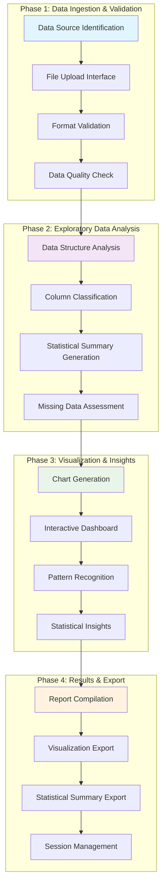
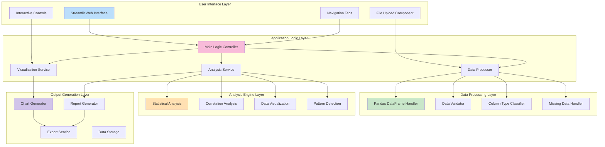
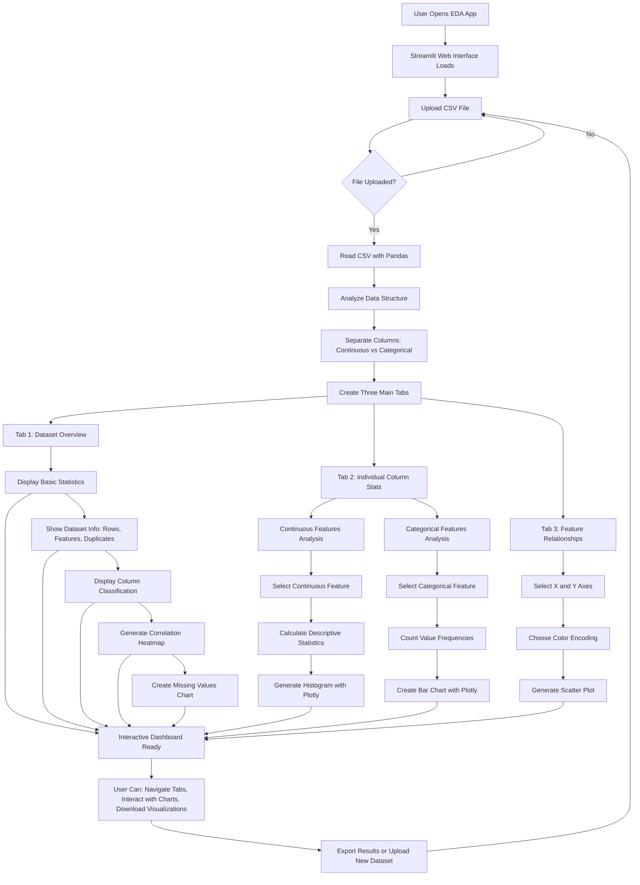
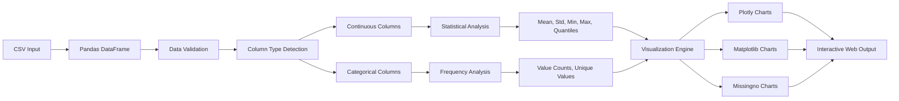
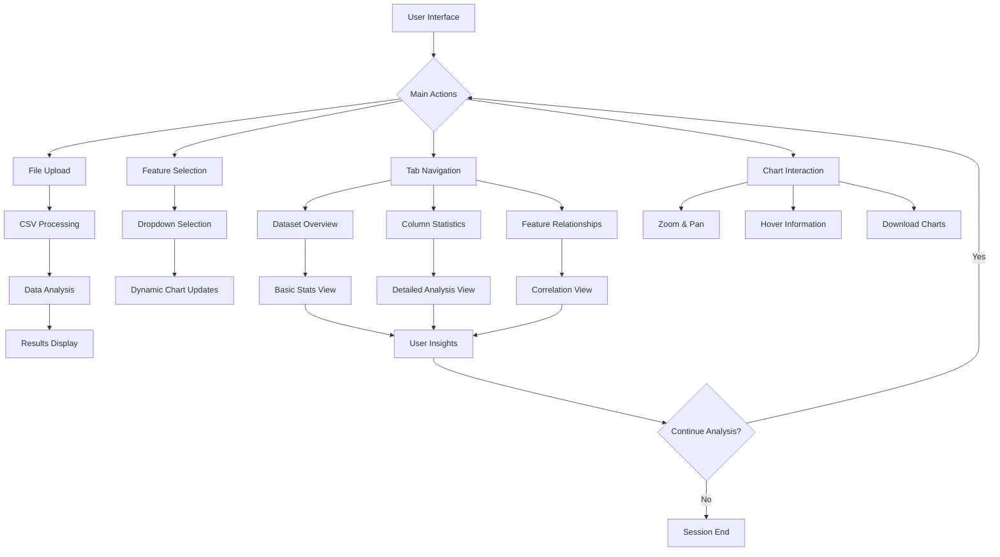
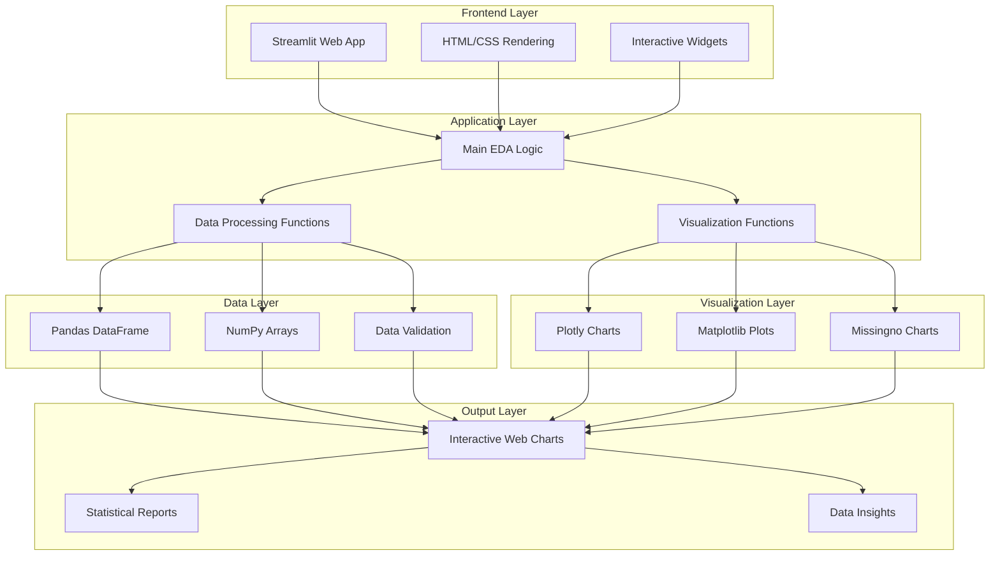
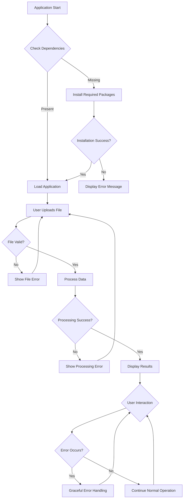

# 🔄 EDA Application Flowchart

## 📋 **Proposed Methodology & Workflow**

## 🏗️ **System Block Diagram**

## Application Workflow

## Data Processing Flow

## User Interaction Flow

## Technical Architecture

## Error Handling Flow

---

## 📊 **Flowchart Legend**

- **🟦 Blue Boxes**: Main processes and actions
- **🟩 Green Boxes**: Data processing steps
- **🟨 Yellow Boxes**: User interactions
- **🟥 Red Boxes**: Error handling and validation
- **🟪 Purple Boxes**: Output and results

## 🎯 **Key Workflows Illustrated**

1. **Main Application Flow**: Shows the complete user journey from app start to results
2. **Data Processing Flow**: Illustrates how data moves through the system
3. **User Interaction Flow**: Details how users interact with different features
4. **Technical Architecture**: Shows the layered structure of the application
5. **Error Handling Flow**: Demonstrates robust error management

These flowcharts provide a comprehensive visual understanding of how your EDA application works, making it easier for users and developers to understand the system architecture and workflow.
