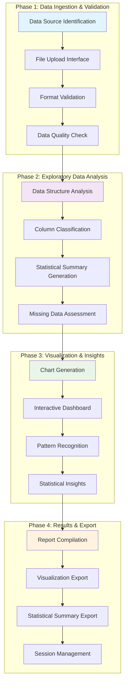

# 📋 **Proposed Methodology & Workflow**

## EDA Application Methodology

This document outlines the systematic approach for conducting Exploratory Data Analysis using the EDA application.

## 🔄 **4-Phase Workflow Diagram**

## 📊 **Phase Details**

### **Phase 1: Data Ingestion & Validation**
- **Data Source Identification**: Identify and prepare data sources
- **File Upload Interface**: User-friendly CSV file upload
- **Format Validation**: Ensure file format compatibility
- **Data Quality Check**: Validate data integrity and structure

### **Phase 2: Exploratory Data Analysis**
- **Data Structure Analysis**: Examine dataset dimensions and types
- **Column Classification**: Separate continuous vs categorical variables
- **Statistical Summary Generation**: Calculate descriptive statistics
- **Missing Data Assessment**: Identify and analyze missing values

### **Phase 3: Visualization & Insights**
- **Chart Generation**: Create various chart types (histograms, bar charts, scatter plots)
- **Interactive Dashboard**: Build user-friendly navigation interface
- **Pattern Recognition**: Identify trends and relationships in data
- **Statistical Insights**: Generate meaningful conclusions from analysis

### **Phase 4: Results & Export**
- **Report Compilation**: Aggregate all findings and visualizations
- **Visualization Export**: Allow users to download charts
- **Statistical Summary Export**: Provide downloadable statistical reports
- **Session Management**: Handle user sessions and data persistence

## 🎯 **Key Benefits of This Methodology**

1. **Systematic Approach**: Ensures no critical analysis steps are missed
2. **User-Centric Design**: Focuses on user experience and needs
3. **Quality Assurance**: Built-in validation at each phase
4. **Scalability**: Can handle datasets of varying sizes and complexity
5. **Reproducibility**: Consistent results across different datasets
